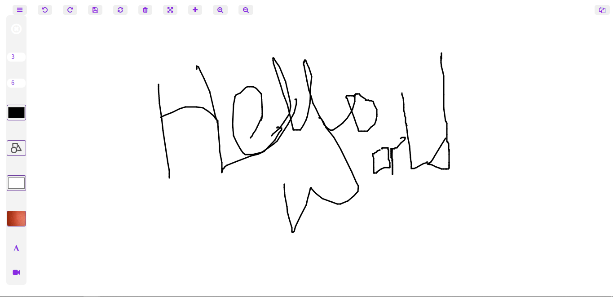

Featured web white board with pure html, css & js.  
Along with screen sharing feature.  
Can be integrated with any web-based apps easily.  

<h3> Features: </h3>

[x] Undo & Redo  
[x] Clearing & Deleting boards  
[x] Downloading boards  
[x] Multiple boards  
[x] Zoom in/out board  
[x] Full screen mode  
[x] Multi colored & sized pen & Eraser  
[x] Multiple shape  
[x] Multiple Background color   
[x] Share screen/board   

<h3> TODO: </h3>

[ ] Background image is not working properly!.  
[ ] Make responsive board.  
[ ] Draw image without affecting canvas position.  
[ ] Writing text in the canvas.  
[ ] Drawing 1 shape is remaining.  
[ ] Add some animation for cool view.  
[ ] Sharing screen via internet(till now, can share on single computer).  
[ ] Prevent page from auto refresh.  
[ ] Get confirmation while closing tab. 

  

[Open Website](https://manish404.github.io/web-whiteboard/)